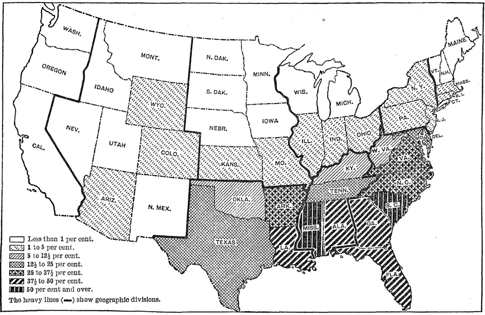
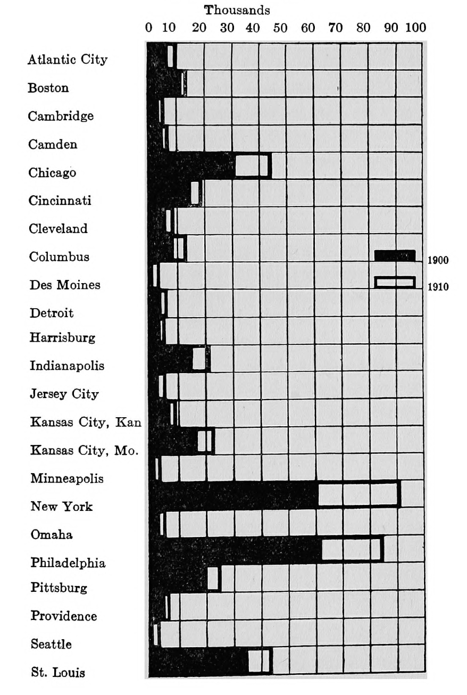
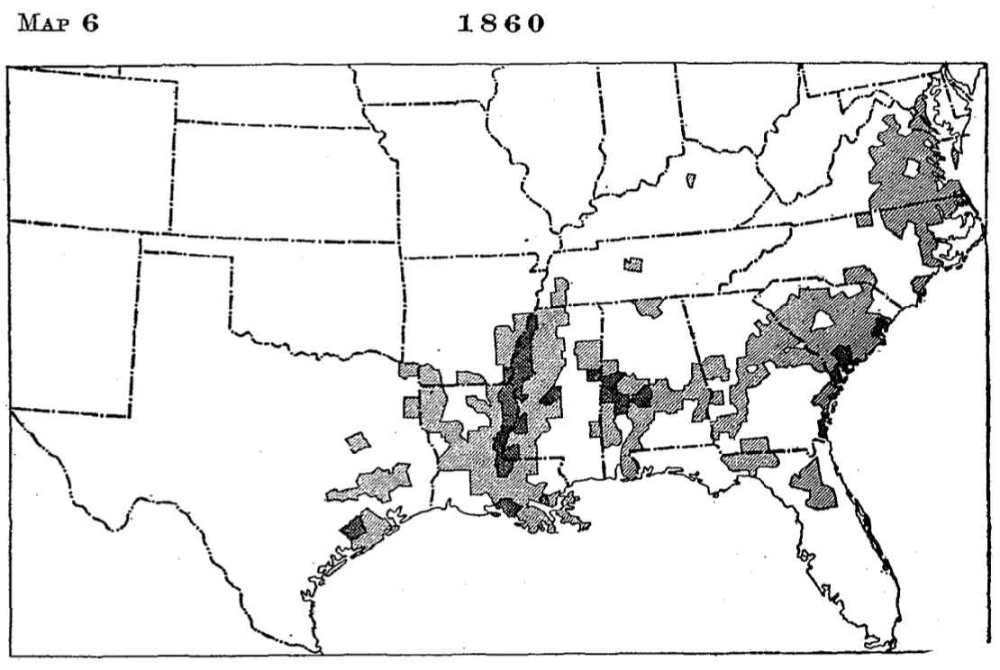
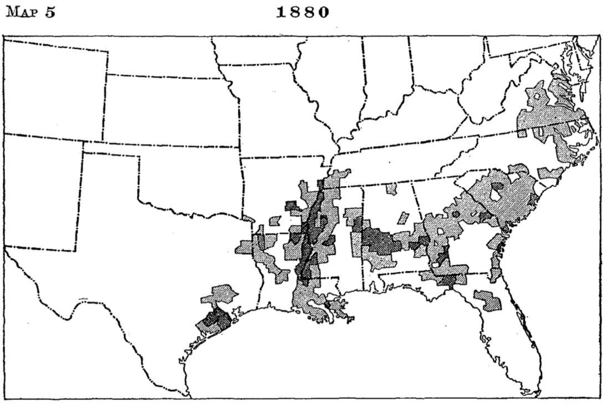
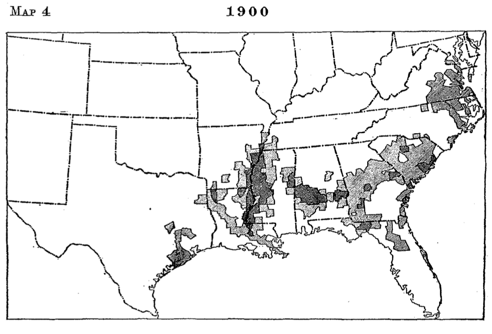
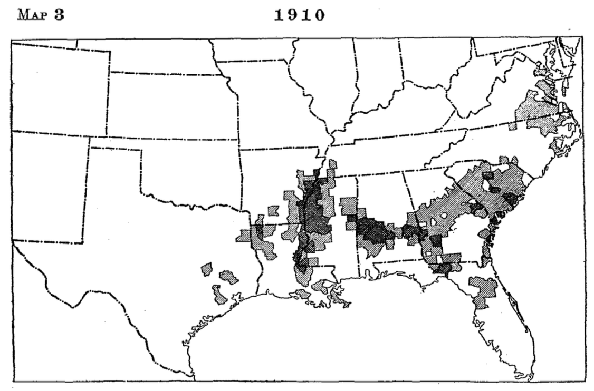

# The Migration of the Talented Tenth

In spite of these interstate movements, the Negro still continued as a perplexing problem, for the country was unprepared to grant the race political and civil rights. Nominal equality was forced on the South at the point of the sword and the North reluctantly removed most of its barriers against the blacks. Some, still thinking, however, that the two races could not live together as equals, advocated ceding the blacks the region on the Gulf of Mexico.[^chapter-08-1] This was branded as chimerical on the ground that, deprived of the guidance of the whites, these States would soon sink to African level and the end of the experiment would be a reconquest and a military regime fatal to the true development of American institutions.[^chapter-08-2] Another plan proposed was the revival of the old colonization idea of sending Negroes to Africa, but this exhibited still less wisdom than the first in that it was based on the hypothesis of deporting a nation, an expense which no government would be willing to incur. There were then no physical means of transporting six or seven millions of people, moreover, as there would be a new born for every one the agents of colonization could deport.[^chapter-08-3]

With the deportation scheme still kept before the people by the American Colonization Society, the idea of emigration to Africa did not easily die. Some Negroes continued to emigrate to Liberia from year to year. This policy was also favored by radicals like Senator Morgan, of Alabama, who, after movements like the Ku Klux Klan had done their work of intimidating Negroes into submission to the domination of the whites, concluded that most of the race believed that there was no future for the blacks in the United States and that they were willing to emigrate. These radicals advocated the deportation of the blacks to prevent the recurrence of "Negro domination." This plan was acceptable to the whites in general also, for, unlike the consensus of opinion of today, it was then thought that the South could get along without the Negro.[^chapter-08-4] Even newspapers like the *Charleston News and Courier*, which denounced the persecution of the Negroes, urged them to emigrate to Africa as they could not be permitted to rule over the white people. The *Minneapolis Times* wished the scheme success and Godspeed and believed that the sooner it was carried out the better it would be for the Negroes.

Most of the influential newspapers of the country, however, urged the contrary. Citing the progress of the Negroes since emancipation to show that the blacks were doing their full share toward developing the wealth of the South, the *Indianapolis Journal* characterized as barbarism the suggestion that the government should furnish them transportation to Africa. "The ancestors of most of the Negroes now in this country," said the editor, "have doubtless been here as long as those of Senator Morgan, and their descendants are as thoroughly acclimated and have as good a right here as the Senator himself."[^chapter-08-5] This was the opinion of all useful Negroes except Bishop H.M. Turner, who endorsed Morgan's plan by advocating the emigration of one fourth of the blacks to Africa. The editor of the *Chicago Record-Herald* entreated Turner to temper his enthusiasm with discretion before he involved in unspeakable disaster any more of his trustful compatriots.

Speaking more plainly to the point, the editor of the *Philadelphia North American* said that the true interest of the South was to accommodate itself to changed conditions and that the duty of the freedmen lies in making themselves worth more in the development of the South than they were as chattels. Although recognizing the disabilities and hardships of the South both to the whites and the blacks, he could not believe that the elimination of the Negroes would, if practicable, give relief.[^chapter-08-6] The *Boston Herald* inquired whether it was worth while to send away a laboring population in the absence of whites to take its place and referred to the misfortunes of Spain which undertook to carry out such a scheme. Speaking the real truth, *The Milwaukee Journal* said that no one needed to expect any appreciable decrease in the black population through any possible emigration, no matter how successful it might be. "The Negro," said the editor, "is here to stay and our institutions must be adapted to comprehend him and develop his possibilities." *The Colored American*, then the leading Negro organ of thought in the United States, believed that the Negroes should be thankful to Senator Morgan for his attitude on emigration, because he might succeed in deporting to Africa those Negroes who affect to believe that this is not their home and the more quickly we get rid of such foolhardy people the better it will be for the stalwart of the race.[^chapter-08-7]

A number of Negroes, however, under the inspiration of leaders[^chapter-08-8] like Bishop H.M. Turner, did not feel that the race had a fair chance in the United States. A few of them emigrated to Wapimo, Mexico; but, becoming dissatisfied with the situation there, they returned to their homes in Georgia and Alabama in 1895. The coming of the Negroes into Mexico caused suspicion and excitement. A newspaper, *El Tiempo*, which had been denouncing lynching in the United States, changed front when these Negroes arrived in that country.

Going in quest of new opportunities and desiring to reenforce the civilization of Liberia, 197 other Negroes sailed from Savannah, Georgia, for Liberia, March 19, 1895. Commending this step, the *Macon Telegraph* referred to their action as a rebellion against the social laws which govern all people of this country. This organ further said that it was the outcome of a feeling which has grown stronger and stronger year by year among the Negroes of the Southern States and which will continue to grow with the increase of education and intelligence among them. The editor conceded that they had an opportunity to better their material condition and acquire wealth here but contended that they had no chance to rise out of the peasant class. The *Memphis Commercial Appeal* urged the building of a large Negro nation in Africa as practicable and desirable, for it was "more and more apparent that the Negro in this country must remain an alien and a disturber," because there was "not and can never be a future for him in this country." The *Florida Times Union* felt that this colonization scheme, like all others, was a fraud. It referred to the Negro's being carried to the land of plenty only to find out that there, as everywhere else in the world, an existence must be earned by toil and that his own old sunny southern home is vastly the better place.[^chapter-08-9]

Only a few intelligent Negroes, however, had reached the position of being contented in the South. The Negroes eliminated from politics could not easily bring themselves around to thinking that they should remain there in a state of recognized inferiority, especially when during the eighties and nineties there were many evidences that economic as well as political conditions would become worse. The exodus treated in the previous chapter was productive of better treatment for the Negroes and an increase in their wages in certain parts of the South but the migration, contrary to the expectations of many, did not become general. Actual prosperity was impossible even if the whites had been willing to give the Negro peasants a fair chance. The South had passed through a disastrous war, the effects of which so blighted the hopes of its citizens in the economic world that their land seemed to pass, so to speak, through a dark age. There was then little to give the man far down when the one to whom he of necessity looked for employment was in his turn bled by the merchant or the banker of the larger cities, to whom he had to go for extensive credits.[^chapter-08-10]

Southern planters as a class, however, had not much sympathy for the blacks who had once been their property and the tendency to cheat them continued, despite the fact that many farmers in the course of time extricated themselves from the clutches of the loan sharks. There were a few Negroes who, thanks to the honesty of certain southern gentlemen, succeeded in acquiring considerable property in spite of their handicaps.[^chapter-08-11] They yielded to the white man's control in politics, when it seemed that it meant either to abandon that field or die, and devoted themselves to the accumulation of wealth and the acquisition of education.

This concession, however, did not satisfy the radical whites, as they thought that the Negro might some day return to power. Unfortunately, therefore, after the restoration of the control of the State governments to the master class, there swept over these commonwealths a wave of hostile legislation demanded by the poor white uplanders determined to debase the blacks to the status of the free Negroes prior to the Civil War.[^chapter-08-12] The Negroes have, therefore, been disfranchised in most reconstructed States, deprived of the privilege of serving in the State militia, segregated in public conveyances, and excluded from public places of entertainment. They have, moreover, been branded by public opinion as pariahs of society to be used for exploitation but not to be encouraged to expect that their status can ever be changed so as to destroy the barriers between the races in their social and political relations.

This period has been marked also by an effort to establish in the South a system of peonage not unlike that of Mexico, a sort of involuntary servitude in that one is considered legally bound to serve his master until a debt contracted is paid. Such laws have been enacted in Florida, Alabama, Georgia, Mississippi, North Carolina, and South Carolina. No such distinction in law has been able to stand the constitutional test of the United States courts as was evidenced by the decision of the Supreme Court in 1911 declaring the Alabama law unconstitutional.[^chapter-08-13] But the planters of the South, still a law unto themselves, have maintained actual slavery in sequestered; districts where public opinion against peonage is too weak to support federal authorities in exterminating it.[^chapter-08-14] The Negroes themselves dare not protest under penalty of persecution and the peon concerned usually accepts his lot like that of a slave. Some years ago it was commonly reported that in trying to escape, the persons undertaking it often fail and suffer death at the hands of the planter or of murderous mobs, giving as their excuse, if any be required, that the Negro is a desperado or some other sort of criminal.

Unfortunately this reaction extended also to education. Appropriations to public schools for Negroes diminished from year to year and when there appeared practical leaders with, their sane plan for industrial education the South ignorantly accepted this scheme as a desirable subterfuge for seeming to support Negro education and at the same time directing the development of the blacks in such a way that they would never become the competitors of the white people. This was not these educators' idea but the South so understood it and in effecting the readjustment, practically left the Negroes out of the pale of the public school systems. Consequently, there has been added to the Negroes' misfortunes, in the South, that of being unable to obtain liberal education at public expense, although they themselves, as the largest consumers in some parts, pay most of the taxes appropriated to the support of schools for the youth of the other race.[^chapter-08-15]

The South, moreover, has adopted the policy of a more general intimidation of the Negroes to keep them down. The lynching of the blacks, at first for assaults on white women and later for almost any offense, has rapidly developed as an institution. Within the past fifty years [^chapter-08-16] there have been lynched in the South about 4,000 Negroes, many of whom have been publicly burned in the daytime to attract crowds that usually enjoy such feats as the tourney of the Middle Ages. Negroes who have the courage to protest against this barbarism have too often been subjected to indignities and in some cases forced to leave their communities or suffer the fate of those in behalf of whom they speak. These crimes of white men were at first kept secret but during the last two generations the culprits have become known as heroes, so popular has it been to murder Negroes. It has often been discovered also that the officers of these communities take part in these crimes and the worst of all is that politicians like Tillman, Blease and Vardaman glory in recounting the noble deeds of those who deserve so well of their countrymen for making the soil red with the Negroes' blood rather than permit the much feared Africanization of southern institutions.[^chapter-08-17]

In this harassing situation the Negro has hoped that the North would interfere in his behalf, but, with the reactionary Supreme Court of the United States interpreting this hostile legislation as constitutional in conformity with the demands of prejudiced public opinion, and with the leaders of the North inclined to take the view that after all the factions in the South must be left alone to fight it out, there has been nothing to be expected from without. Matters too have been rendered much worse because the leaders of the very party recently abandoning the freedmen to their fate, aggravated the critical situation by first setting the Negroes against their former masters, whom they were taught to regard as their worst enemies whether they were or not.

The last humiliation the Negroes have been forced to submit to is that of segregation. Here the effort has been to establish a ghetto in cities and to assign certain parts of the country to Negroes engaged in farming. It always happens, of course, that the best portion goes to the whites and the least desirable to the blacks, although the promoters of the segregation maintain that both races are to be treated equally. The ultimate aim is to prevent the Negroes of means from figuring conspicuously in aristocratic districts where they may be brought into rather close contact with the whites. Negroes see in segregation a settled policy to keep them down, no matter what they do to elevate themselves. The southern white man, eternally dreading the miscegenation of the races, makes the life, liberty and happiness of individuals second to measures considered necessary to prevent this so-called evil that this enviable civilization, distinctly American, may not be destroyed. The United States Supreme Court in the decision of the Louisville segregation case recently declared these segregation measures unconstitutional.[^chapter-08-18]

These restrictions have made the progress of the Negroes more of a problem in that directed toward social distinction, the Negroes have been denied the helpful contact of the sympathetic whites. The increasing race prejudice forces the whites to restrict their open dealing with the blacks to matters of service and business, maintaining even then the bearing of one in a sphere which the Negroes must not penetrate. The whites, therefore, never seeing the blacks as they are, and the blacks never being able to learn what the whites know, are thrown back on their own initiative, which their life as slaves could not have permitted to develop. It makes little difference that the Negroes have been free a few decades. Such freedom has in some parts been tantamount to slavery, and so far as contact with the superior class is concerned, no better than that condition; for under the old regime certain slaves did learn much by close association with their masters.[^chapter-08-19]

For these reasons there has been since the exodus to the West a steady migration of Negroes from the South to points in the North. But this migration, mainly due to political changes, has never assumed such large proportions as in the case of the more significant movements due to economic causes, for, as the accompanying map shows, most Negroes are still in the South. When we consider the various classes migrating, however, it will be apparent that to understand the exodus of the Negroes to the North, this longer drawn out and smaller movement must be carefully studied in all its ramifications. It should be noted that unlike some of the other migrations it has not been directed to any particular State. It has been from almost all Southern States to various parts of the North and especially to the largest cities.[^chapter-08-20]

What classes then have migrated? In the first place, the Negro politicians, who, after the restoration of Bourbon rule in the South, found themselves thrown out of office and often humiliated and impoverished, had to find some way out of the difficulty. Some few have been relieved by sympathetic leaders of the Republican party, who secured for them federal appointments in Washington. These appointments when sometimes paying lucrative salaries have been given as a reward to those Negroes who, although dethroned in the South, remain in touch with the remnant of the Republican party there and control the delegates to the national conventions nominating candidates for President. Many Negroes of this class have settled in Washington.[^chapter-08-21] In some cases, the observer witnesses the pitiable scene of a man once a prominent public functionary in the South now serving in Washington as a messenger or a clerk.

The well-established blacks, however, have not been so easily induced to go. The Negroes in business in the South have usually been loath to leave their people among whom they can acquire property, whereas, if they go to the North, they have merely political freedom with no assurance of an opportunity in the economic world. But not a few of these have given themselves up to unrelenting toil with a view to accumulating sufficient wealth to move North and live thereafter on the income from their investments. Many of this class now spend some of their time in the North to educate their children. But they do not like to have these children who have been under refining influences return to the South to suffer the humiliation which during the last generation has been growing more and more aggravating. Endeavoring to carry out their policy of keeping the Negro down, southerners too often carefully plan to humiliate the progressive and intelligent blacks and in some cases form mobs to drive them out, as they are bad examples for that class of Negroes whom they desire to keep as menials.[^chapter-08-22]

There are also the migrating educated Negroes. They have studied history, law and economics and well understand what it is to get the rights guaranteed them by the constitution. The more they know the more discontented they become. They cannot speak out for what they want. No one is likely to second such a protest, not even the Negroes themselves, so generally have they been intimidated. The more outspoken they become, moreover, the more necessary is it for them to leave, for they thereby destroy their chances to earn a livelihood. White men in control of the public schools of the South see to it that the subserviency of the Negro teachers employed be certified beforehand. They dare not complain too much about equipment and salaries even if the per capita appropriation for the education of the Negroes be one fourth of that for the whites.[^chapter-08-23]

In the higher institutions of learning, especially the State schools, it is exceptional to find a principal who has the confidence of the Negroes. The Negroes will openly assert that he is in the pay of the reactionary whites, whose purpose is to keep the Negro down; and the incumbent himself will tell his board of regents how much he is opposed by the Negroes because he labors for the interests of the white race. Out of such sycophancy it is easily explained why our State schools have been so ineffective as to necessitate the sending of the Negro youth to private institutions maintained by northern philanthropy. Yet if an outspoken Negro happens to be an instructor in a private school conducted by educators from the North, he has to be careful about contending for a square deal; for, if the head of his institution does not suggest to him to proceed conservatively, the mob will dispose of the complainant.[^chapter-08-24] Physicians, lawyers and preachers, who are not so economically dependent as teachers can exercise no more freedom of speech in the midst of this triumphant rule of the lawless.

{#fig-diagram}

A large number of educated Negroes, therefore, have on account of these conditions been compelled to leave the South. Finding in the North, however, practically nothing in their line to do, because of the proscription by race prejudice and trades unions, many of them lead the life of menials, serving as waiters, porters, butlers and chauffeurs. While in Chicago, not long ago, the writer was in the office of a graduate of a colored southern college, who was showing his former teacher the picture of his class. In accounting for his classmates in the various walks of life, he reported that more than one third of them were settled to the occupation of Pullman porters.

The largest number of Negroes who have gone North during this period, however, belong to the intelligent laboring class. Some of them have become discontented for the very same reasons that the higher classes have tired of oppression in the South, but the larger number of them have gone North to improve their economic condition. Most of these have migrated to the large cities in the East and Northwest, such as Philadelphia, New York, Indianapolis, Pittsburgh, Cleveland, Columbus, Detroit, and Chicago. To understand this problem in its urban aspects the accompanying diagram showing the increase in the Negro population of northern cities during the first decade of this century will be helpful.

Some of these Negroes have migrated after careful consideration; others have just happened to go north as wanderers; and a still larger number on the many excursions to the cities conducted by railroads during the summer months. Sometimes one excursion brings to Chicago two or three thousand Negroes, two thirds of whom never go back. They do not often follow the higher pursuits of labor in the North but they earn more money than they have been accustomed to earn in the South. They are attracted also by the liberal attitude of some whites, which, although not that of social equality, gives the Negroes a liberty in northern centers which leads them to think that they are citizens of the country.[^chapter-08-25]

This shifting in the population has had an unusually significant effect on the black belt. Frederick Douglass advised the Negroes in 1879 to remain in the South where they would be in sufficiently large numbers to have political power,[^chapter-08-26] but they have gradually scattered from the black belt so as to diminish greatly their chances ever to become the political force they formerly were in this country. The Negroes once had this possibility in South Carolina, Georgia, Alabama, Mississippi and Louisiana and, had the process of Africanization prior to the Civil War had a few decades longer to do its work, there would not have been any doubt as to the ultimate preponderance of the Negroes in those commonwealths. The tendencies of the black population according to the censuses of the United States and especially that of 1910, however, show that the chances for the control of these State governments by Negroes no longer exist except in South Carolina and Mississippi.[^chapter-08-27] It has been predicted, therefore, that, if the same tendencies continue for the next fifty years, there will be even few counties in which the Negroes will be in a majority. All of the Southern States except Arkansas showed a proportionate increase of the white population over that of the black between 1900 and 1910, while West Virginia and Oklahoma with relatively small numbers of blacks showed, for reasons stated elsewhere, an increase in the Negro population. Thus we see coming to pass something like the proposed plan of Jefferson and other statesmen who a hundred years ago advocated the expansion of slavery to lessen the evil of the institution by distributing its burdens.[^chapter-08-28]

::: {#fig-years layout-ncol=2}

:::

The migration of intelligent blacks, however, has been attended with several handicaps to the race. The large part of the black population is in the South and there it will stay for decades to come. The southern Negroes, therefore, have been robbed of their due part of the talented tenth. The educated blacks have had no constituency in the North and, consequently, have been unable to realize their sweetest dreams of the land of the free. In their new home the enlightened Negro must live with his light under a bushel. Those left behind in the South soon despair of seeing a brighter day and yield to the yoke. In the places of the leaders who were wont to speak for their people, the whites have raised up Negroes who accept favors offered them on the condition that their lips be sealed up forever on the rights of the Negro.

This emigration too has left the Negro subject to other evils. There are many first-class Negro business men in the South, but although there were once progressive men of color, who endeavored to protect the blacks from being plundered by white sharks and harpies there have arisen numerous unscrupulous Negroes who have for a part of the proceeds from such jobbery associated themselves with ill-designing white men to dupe illiterate Negroes. This trickery is brought into play in marketing their crops, selling them supplies, or purchasing their property. To carry out this iniquitous plan the persons concerned have the protection of the law, for while Negroes in general are imposed upon, those engaged in robbing them have no cause to fear.

[^chapter-08-1]: Pike, *The Prostrate State*, pp. 3, 4.

[^chapter-08-2]: *Spectator*, LXVI, p. 113.

[^chapter-08-3]: Frederick Douglass pointed out this difficulty prior to the Civil War.--See John Lobb's *Life and Times of Frederick Douglass*, p. 250.

[^chapter-08-4]: Labor was then cheap in the South because of its abundance and the foreign laborer had not then been tried.

[^chapter-08-5]: During these years Senator Morgan of Alabama was endeavoring to arouse the people of the country so as to make this a matter of national concern.

[^chapter-08-6]: *Public Opinion*, XVIII, p. 371.

[^chapter-08-7]: *Ibid.*, XVIII, p. 371.

[^chapter-08-8]: Simmons, *Men of Mark*, p. 817.

[^chapter-08-9]: *Public Opinion*, XVIII, pp. 370-371.

[^chapter-08-10]: Because of these conditions the last fifty years has been considered by some writers as a "dark age," for the South.

[^chapter-08-11]: The Negroes are now said to be worth more than a billion dollars. Most of this property is in the hands of southern Negroes.

[^chapter-08-12]: *American Law Review*, XL, pp. 29, 52, 205, 227, 354, 381, 547, 590, 695, 758, 865, 905.

[^chapter-08-13]: No. 300.--Original, October Term, 1910.

[^chapter-08-14]: Hershaw, *Peonage*, pp. 10-11.

[^chapter-08-15]: These facts are well brought out by Dr. Thomas Jesse Jones' recent report on Negro Education.

[^chapter-08-16]: This is based on reports published annually in the *Chicago Tribune*.

[^chapter-08-17]: This is the boast of southern men of this type when speaking to their constituents or in Congress.

[^chapter-08-18]: *Report*, October Term, 1917.

[^chapter-08-19]: This danger has been often referred to when the Negroes were first emancipated.--See *Spectator*, LXVI, p. 113.

[^chapter-08-20]: Compare the Negro population of Northern States as given in the census of 1800 with the same in 1900.

[^chapter-08-21]: Hart, *Southern South*, pp. 171, 172.

[^chapter-08-22]: This is based on the experience of the writer and others whom he has interviewed.

[^chapter-08-23]: In his report on Negro education Dr. Thomas Jesse Jones has shown this to be an actual fact.

[^chapter-08-24]: Negroes applying for positions in the South have the situation set before them so as to know what to expect.

[^chapter-08-25]: The *American Journal of Political Economy*, XXV, p. 1040.

[^chapter-08-26]: The *Journal of Social Science*, XI, p. 16.

[^chapter-08-27]: *American Economic Review*, IV, pp. 281-292.

[^chapter-08-28]: Ford edition of *Jefferson's Writings*, X, p. 231.
